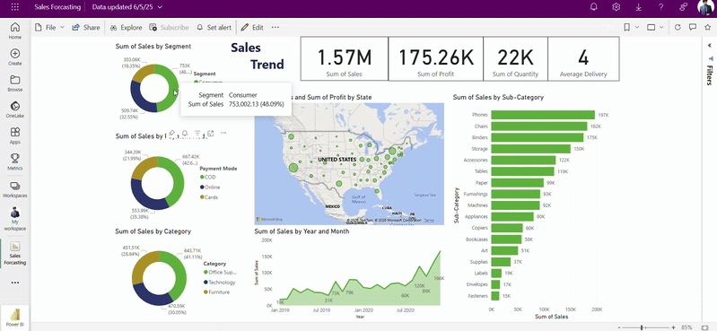

# 📊 Sales Forecasting Dashboard (Power BI)

This repository presents an interactive **Power BI dashboard** for analyzing and forecasting sales trends based on the **SuperStore Sales dataset**. The dashboard offers clear, data-driven insights to support business decision-making through visual storytelling.

---

## 🎥 Dashboard Preview

---
[Published Report](https://fs.blabigo.com/s/pmKNMHmh)

## 📁 Files Included

- `Sales Forecasting.pbix` — Power BI dashboard file : [Link](https://drive.google.com/file/d/19tq3HR59WglTfN5xHu45BS5l48O8ajFp/view?usp=sharing) 
- `SuperStore Sales DataSet.xlsx` — Excel file with raw data : [Link](https://docs.google.com/spreadsheets/d/1zhA7vW_gXcdELm5LBwne-QsbYsvmy2Nf/edit?usp=sharing&ouid=113253472637395191501&rtpof=true&sd=true)

---

## 📈 Dashboard Highlights

- 📅 **Sales Forecasting**: Time-series forecasting of monthly sales using Power BI’s analytics
- 🌍 **Geo Insights**: State-wise performance visualized on a U.S. map
- 📦 **Product Analysis**: Sub-category breakdown showing top-selling items
- 👥 **Customer Segments**: Filter views by segment (Consumer, Corporate, Home Office)
- 💳 **Payment Modes & Delivery**: Analysis of mode usage and average delivery times
- 📊 **KPI Cards**: Total Sales, Profit, Quantity, and Delivery Averages

---

## 🔍 Insights Discovered

- 📈 Steady growth in **Technology** and **Office Supplies**
- 🏙 High sales concentrations in **California**, **New York**, and **Texas**
- 📦 **Phones**, **Chairs**, and **Binders** top the list of high-performing sub-categories
- 📉 Certain categories show declining trends — worth investigating for strategy shifts

---

## 🛠 Tools Used

- Microsoft Power BI Desktop
- Power Query
- DAX (Data Analysis Expressions)
- Microsoft Excel

---

## 📥 How to Use

1. Download the `.pbix` file from this repository.
2. Open using [Power BI Desktop](https://powerbi.microsoft.com/desktop/).
3. Optional: Refresh data using the provided Excel file.
4. Explore visualizations, filters, and forecasts.

---

## 📬 Contact

**Created by:** [Charchit Dhawan]  
📧 Email: [charchitdhawan@gmail.com]  
💼 LinkedIn: [https://www.linkedin.com/in/charchit-dhawan-902232110/]  

---

## ⭐️ Support

If you found this project useful or insightful, consider giving it a ⭐️ and sharing it!

